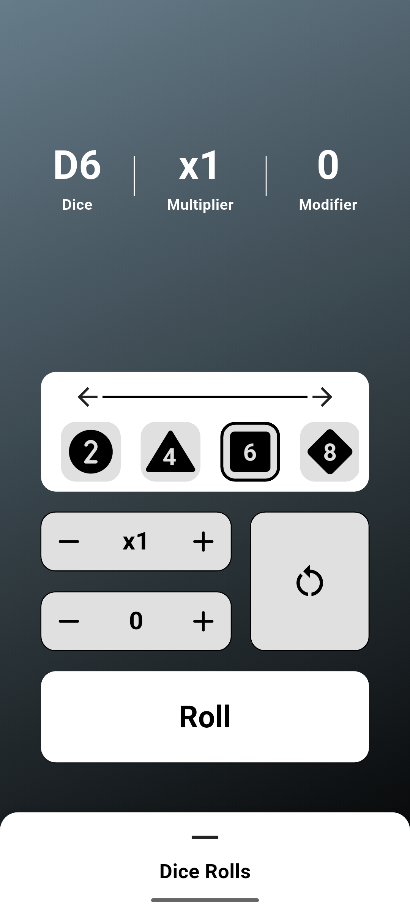
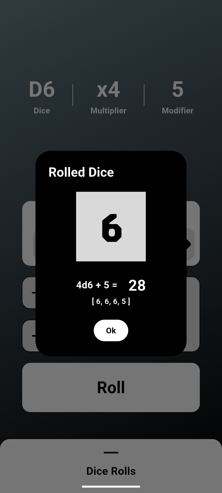
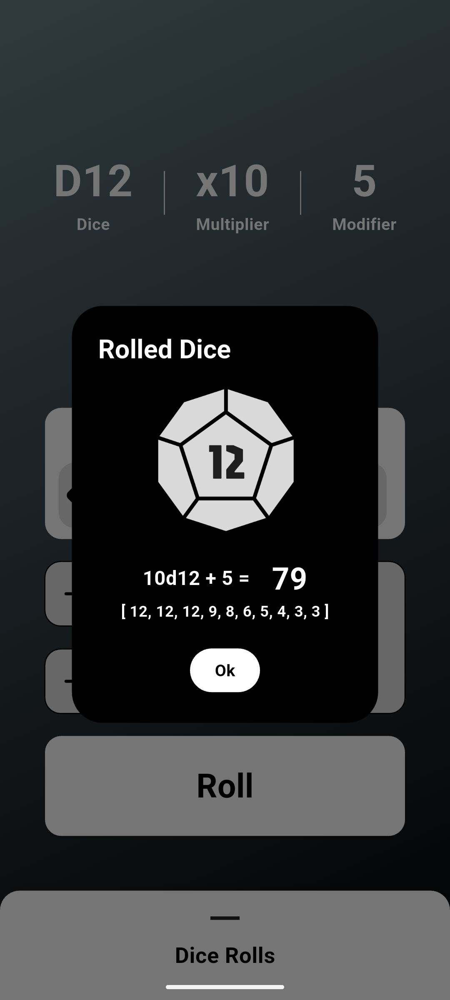
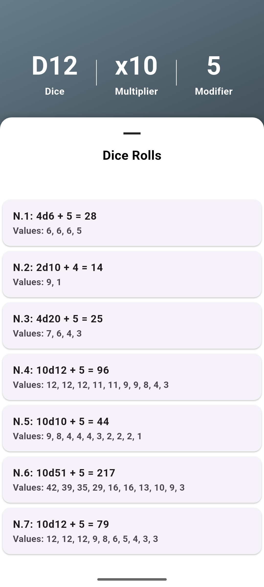

    

# 🎲 Dice Roller

A sleek and dynamic Flutter application that brings the thrill of dice rolling to your device! Perfect for board games, tabletop RPGs, or any situation where you need random numbers with style.

## ✨ Features

### 🎯 Core Functionality
- **Multi-Dice Rolling**: Roll up to 10 dice simultaneously
- **Diverse Dice Types**: Support for all standard dice (d4, d6, d8, d10, d12, d20) and coin (d2)
- **Bonus and Malus**: Add bonus or malus to your dice result to better immerse yourself in your D&D game
- **Custom Dice**: Use a custom dice with the number of sides you prefer (up to 100)
- **Sum Calculation**: Automatic total calculation of all rolled dice
- **Roll History**: Track your previous rolls with timestamps

### 🛠 Technical Features
- **Offline Support**: Works without internet connection
- **Low Battery Usage**: Optimized performance
- **Small App Size**: Minimal storage footprint
- **Fast Launch Time**: Instant app availability

## 📱 Screenshots

    
    
    
    

## 💡 Usage

1. Select your desired dice type from the menu
2. Choose the number of dice (1-10)
3. Add a modifier to your dice roll 
4. Tap the roll button
5. View results and history

---
Made with ❤️ using Flutter